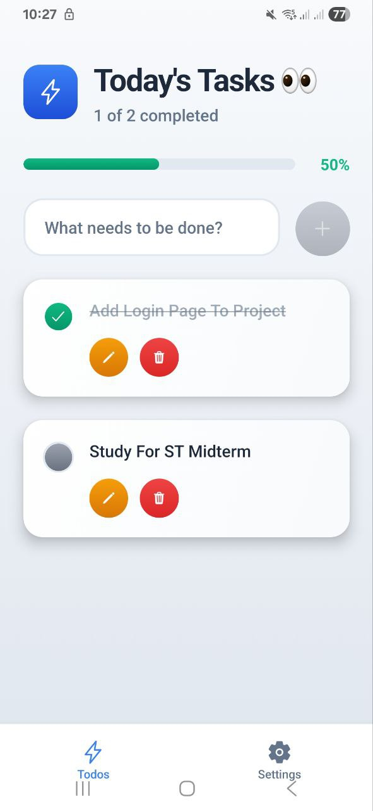

# 📱 Welcome to Your Expo App 👋

This is an [Expo](https://expo.dev) project created with [`create-expo-app`](https://www.npmjs.com/package/create-expo-app).

---

## 🚀 Get Started

1. **Install dependencies**

   ```bash
   npm install
   ```

2. **Start the app**

   ```bash
   npx expo start
   ```

After running the command, you can open the app in:

- 📱 [Development build](https://docs.expo.dev/develop/development-builds/introduction/)
- 🧩 [Android emulator](https://docs.expo.dev/workflow/android-studio-emulator/)
- 🍏 [iOS simulator](https://docs.expo.dev/workflow/ios-simulator/)
- 🌐 [Expo Go](https://expo.dev/go)

You can start developing by editing the files inside the **`app`** directory.  
This project uses [file-based routing](https://docs.expo.dev/router/introduction/).

---

## ⚙️ Backend

This project is connected to a **Node.js backend** built with:

- **Koa.js** — lightweight and modern web framework for Node.js
- **Knox** — used for secure file management and AWS S3 integration
- **MongoDB / PostgreSQL** — as the main database (depending on your setup)
- **JWT Authentication** — for secure login and register process
- **RESTful APIs** — for full frontend-backend communication

The backend handles authentication, user data, and product management.

---

## 🖼️ App Preview

Here are some preview images of the app:

|  |  |  |  |

---

## 💻 Technologies Used

### Frontend:
- React Native (Expo)
- Tailwind CSS via NativeWind
- React Navigation

### Backend:
- Convex

---

## 🧠 Author

Developed  by **Pari Cheraghi**

If you like this project, don’t forget to ⭐ it on GitHub!

---

## 📄 License

This project is licensed under the [MIT License](LICENSE).